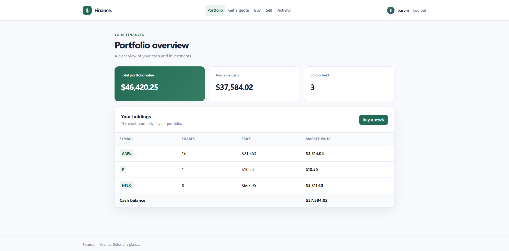
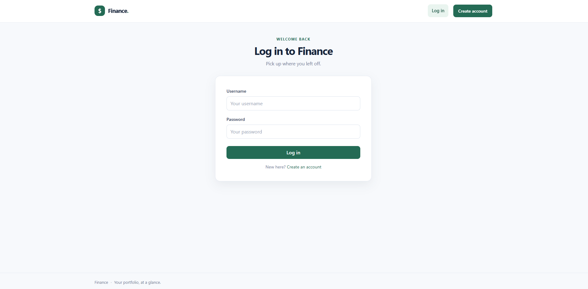

# 💰 Finance — Stock Trading Web Application

A full-stack stock trading web application built with **Python, Flask, SQLite, HTML, CSS, and JavaScript**.

The application allows users to create an account, look up stock prices, buy and sell stocks, manage their portfolio, and view their complete transaction history.

This project was developed as part of **CS50: Introduction to Computer Science** and helped me practice backend development, databases, authentication, APIs, and web application development.

---

## 📸 Screenshots

### Portfolio

The portfolio page displays the user's current stock holdings, available cash, and total portfolio value.



### Transaction Login

Users can login to his old account or  create a new account.



---

## 🚀 Features

- 👤 User registration and login
- 🔐 User authentication and sessions
- 🔎 Stock price lookup
- 💵 Buy stocks
- 📉 Sell stocks
- 📊 Portfolio overview
- 💰 Cash balance tracking
- 📜 Transaction history
- 👤 User profile
- 🟢 Consistent initials-based avatars in the navigation and profile
- 🗄️ SQLite database
- 📱 Responsive web interface
- ⚠️ Input validation and error handling

---

## 🛠️ Technologies

| Technology   | Purpose                   |
| ------------ | ------------------------- |
| Python       | Backend programming       |
| Flask        | Web framework             |
| CS50 Library | Database interaction      |
| SQLite       | Database                  |
| SQL          | Database queries          |
| HTML5        | Page structure            |
| CSS3         | Styling                   |
| JavaScript   | Client-side functionality |
| Bootstrap    | UI components             |
| Jinja2       | HTML templating           |

---

## 🏗️ Application Architecture

The application follows a simple full-stack architecture:

```text
                   ┌─────────────────┐
                   │      User       │
                   └────────┬────────┘
                            │
                            ▼
                   ┌─────────────────┐
                   │   HTML / CSS    │
                   │   JavaScript    │
                   └────────┬────────┘
                            │
                            ▼
                   ┌─────────────────┐
                   │     Flask       │
                   │    Backend      │
                   └────────┬────────┘
                            │
                ┌───────────┴───────────┐
                │                       │
                ▼                       ▼
        ┌──────────────┐       ┌────────────────┐
        │ Stock API    │       │ SQLite Database│
        └──────────────┘       └────────────────┘
```
